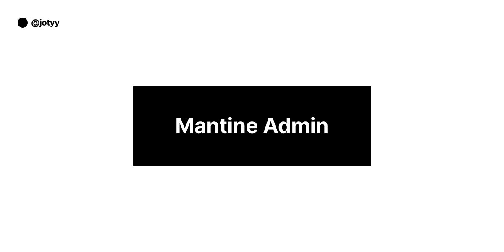

<!-- markdownlint-disable MD014 -->
<!-- markdownlint-disable MD026 -->
<!-- markdownlint-disable MD033 -->
<!-- markdownlint-disable MD041 -->

<h1 align="center">
  Mantine Admin
</h1>

<!-- Banner Section -->
<p align="center">
  
</p>
<h3 align="center">
  💻 A Modern Dashboard with Next.js.!
</h3>

---

<!-- Badges Section -->
<p align="center">
  <a href="./LICENSE" title="Show the MIT License">
    
  </a>
  <br>
  
  
  
  <br>
  <a href="https://vercel.com" title="Open Vercel Website">
    
  </a>
</p>

---

<p align="center">
 <a href="https://sonarcloud.io/summary/new_code?id=gmatthewsfeuer_next-plate">
   
   
   
   
   
   
 </a>
 <a href="https://app.renovatebot.com/dashboard">
   
 </a>
</p>

---

<!-- Link Demo Section -->

## 🚀 [Demo →](https://mantine-admin.vercel.app)

Deploy your own copy of this template in just a few clicks!

<div>
 <a href="https://vercel.com/import/project?template=https://github.com/jotyy/mantine-admin" title="Deploy to Vercel">
  
 </a>

<!-- Introduction Section -->

## 📖 Introduction

This template have a bunch of folders, code examples and configurations. Feel free to edit or remove them, including this README!

**Customize and enjoy!**

<!-- Features Section -->

## 🌟 Features

This project features all the latest tools and good practices in web development!

### Framework

- ⚛️ **[Next.js](https://nextjs.org)** – A complete React framework for hybrid and server rendering

### Data Fetching

- 🌴 **[ky](https://github.com/sindresorhus/ky)** - Tiny and elegant HTTP client based on the browser Fetch API
- ✳️ **[React Query](https://tanstack.com/query)** – Hooks for fetching, caching and updating asynchronous data in React

### State Management and Hooks

- 🐻 **[Zustand](https://zustand-demo.pmnd.rs)** – A small, fast and scalable bearbones state-management solution using simplified flux principles
- 👍 **[react-use](https://github.com/streamich/react-use)** – Collection of essential React Hooks

### Design System and Animations

- 🎨 **[Mantine-UI](https://mantine.dev)** – A simple, modular and accessible component library that gives you the building blocks to build your React applications
- ✨ **[Tabler Icons](https://tabler-icons-react.vercel.app)** – A collection of popular icons to React projects

### Form Validation

- 📋 **[React Hook Form](https://react-hook-form.com)** – Performant, flexible and extensible forms with easy-to-use validation
- 🚨 **[Zod](https://zod.dev)** – TypeScript-first schema validation with static type inference

### Tests

- 🃏 **[Jest](https://jestjs.io)** – A delightful JavaScript Testing Framework with a focus on simplicity
- 🐙 **[Testing Library](https://testing-library.com)** – Simple and complete testing utilities that encourage good testing practices

### Design Patterns

- ⛔ **[ESLint](https://eslint.org)** – Find and fix problems in your JavaScript code
- 🎀 **[Prettier](https://prettier.io)** – An opinionated code formatter, supporting multiple languages and code editors
- 🐺 **[Husky](https://github.com/typicode/husky)** – Modern native Git hooks made easy
- 💩 **[lint-staged](https://github.com/okonet/lint-staged)** – Run linters against staged git files and don't let 💩 slip into your code base
- 📓 **[commitlint](https://commitlint.js.org)** – Helps your team adhering to a commit convention
- 🏷️ **[Standard Version](https://github.com/conventional-changelog/standard-version)** – A utility for versioning using semver and CHANGELOG generation powered by Conventional Commits

### Analysis

- 🕵🏻‍♂️ **[why-did-you-render](https://github.com/welldone-software/why-did-you-render)** (optional) – Notify you about potentially avoidable re-renders

<!-- Procedures Section -->

## ▶️ Getting Started

### 📙 Creating a New Repository on GitHub

1. Click on "**Use this template**" button
2. Configure your new repository and click on "**Create repository from template**" button
3. Now you can clone the generated repository to your local machine:

```bash
 $ git clone https://github.com/<YOUR-GITHUB-LOGIN>/<NAME-OF-YOUR-GENERATED-REPOSITORY>.git
```

### 🛠️ Installation

Before you can start developing your super application, you need to install the project's dependencies.

Move yourself to the root of the project:

```bash
$ cd <NAME-OF-YOUR-GENERATED-REPOSITORY>
```

> For the next steps, choose a package manager of your choice and change the commands contained in the `package.json` scripts. See their documentation for more information:
>
> - [PNPM](https://pnpm.io/pt/cli/add)(Recommand)
> - [NPM](https://docs.npmjs.com/cli/v6/commands)

Install all dependencies of the project:

```bash
# PNPM
$ pnpm install
# NPM
$ npm install
```

### ⌨️ Development

Once all dependencies have been installed, you can run the local development server:

```bash
# PNPM
$ pnpm dev
# NPM
$ npm run dev
```

Now just code!

### 🖥️ Production

After applying the changes, you can generate a build to test and/or deploy to your production environment.

Make a production build:

```bash
# PNPM
$ pnpm build
# NPM
$ npm run build
```

And then run the build:

```bash
# PNPM
$ pnpm start
# NPM
$ npm start
```

<details>
 <summary>View more commands you can use</summary>

 <h4>Lint</h4>

```bash
# PNPM
$ pnpm run lint
# NPM
$ npm run lint
```

 <h4>Lint and Fix</h4>

```bash
# PNPM
$ pnpm run lint:fix
# NPM
$ npm run lint:fix
```

 <h4>Test</h4>

```bash
# PNPM
$ pnpm run test # or pnpm run test:watch
# NPM
$ npm run test # or npm run test:watch
```

 <h4>Type Checking</h4>

```bash
# PNPM
$ pnpm run type-check
# NPM
$ npm run type-check
```

 <h4>Format</h4>

```bash
# PNPM
$ pnpm run format
# NPM
$ npm run format
```

 <h4>Interactive Update Tool</h4>

```bash
# PNPM
$ pnpm run up
# NPM
$ npm run up
```

 <h4>Update All Dependencies</h4>

```bash
# PNPM
$ pnpm run up-latest
# NPM
$ npm run up-latest
```

 <h4>Release As Major Version</h4>

```bash
# PNPM
$ pnpm run release-as-major
# NPM
$ npm run release-as-major
```

 <h4>Release As Minor Version</h4>

```bash
# PNPM
$ pnpm run release-as-minor
# NPM
$ npm run release-as-minor
```

 <h4>Release As Patch Version</h4>

```bash
# PNPM
$ pnpm run release-as-patch
# NPM
$ npm run release-as-patch
```

 <h4>Publish Release</h4>

```bash
# PNPM
$ pnpm run push-release
# NPM
$ npm run push-release
```

 <h4>Get Updates From Remote and Maintain Current Changes</h4>

```bash
# PNPM
$ pnpm run pull
# NPM
$ npm run pull
```

</details>

### ⚙️ Extra Configurations

<details>
 <summary>Why Did You Render</summary>

 <h4>How to Activate</h4>

Put the `babel.config.js` file (located in the path `src/scripts`) in the project root and delete `.babelrc` file.

Uncomment the `wdyr` import line on `pages/_app.tsx`.

That's it! Now you can monitore React re-renders!

 <h4>How to Uninstall</h4>

Just delete the `babel.config.js` and `wdyr.ts` files, remove `wdyr` import line on `pages/_app.tsx` and uninstall it:

```bash
# PNPM
$ pnpm uninstall @welldone-software/why-did-you-render
# NPM
$ npm uninstall @welldone-software/why-did-you-render
```

</details>

<!-- File Tree Section -->

## 📁 File Tree

See below the file tree to understand the project structure.

<details>
 <summary>View file tree</summary>

> Folders and files marked with (`**`) are optional, so you can delete then.

```txt
📂 mantine-admin/
┣ 📂 .github/                   # GitHub's folder configs **
┣ 📂 .husky/                    # Husky's folder
┃ ┣ 📃 commit-msg               # Commitlint git hook
┃ ┗ 📃 pre-commit               # Lint-staged git hook
┣ 📂 .vscode/                   # VSCode's workspace **
┣ 📂 public/                    # Public folder
┃ ┣ 📂 static/                  # Static files folder **
┃ ┃ ┣ 📂 icons/                 # Icons folder **
┃ ┃ ┣ 📂 images/                # Images folder **
┃ ┃ ┣ 📂 sounds/                # Sounds folder **
┃ ┃ ┗ 📂 videos/                # Videos folder **
┃ ┣ 📂 docs/                    # Documentation folder **
┃ ┃ ┣ 📂 demo/                  # Demonstrations project **
┃ ┃ ┗ 📂 translations/          # Translations folder **
┃ ┣ 📃 favicon.ico              # Icon tab browser
┣ 📂 src/
┃ ┣ 📂 app/                   # App pages
┃ ┣ 📂 components/              # App Components
┃ ┃ ┗ 📂 Motion/                # Mantine-UI components **
┃ ┣ 📂 hooks/                   # React Hooks **
┃ ┃ ┗ 📃 useFetch.ts            # SWR fetch hook (optional) **
┃ ┣ 📂 interfaces/              # TypeScript Interfaces
┃ ┣ 📂 scripts/                 # Additional scripts **
┃ ┃ ┣ 📃 babel.config.js        # Babel config with WDYR **
┃ ┃ ┗ 📃 wdyr.ts                # WDYR file **
┃ ┣ 📂 services/                # Services
┃ ┃ ┗ 📂 users/
┃ ┃   ┣ 📃 index.ts             # React Query Configuration
┃ ┃   ┗ 📃 keys.ts              # React Query Key
┃ ┣ 📂 stores/                  # Zustand stores
┃ ┣ 📂 styles/                  # Styles folder
┃ ┃ ┣ 📃 bgImages.ts            # SVG background images **
┃ ┃ ┗ 📃 theme.ts               # Mantine-UI theme
┃ ┗ 📂 utils/                   # Useful functions **
┣ 📃 .babelrc                   # Default Babel config
┣ 📃 .editorconfig              # Editor config
┣ 📃 .eslintignore              # ESLint ignore
┣ 📃 .eslintrc                  # ESLint config
┣ 📃 .gitignore                 # Git ignore
┣ 📃 .versionrc                 # Versioning config
┣ 📃 .commitlintrc              # Commitlint config
┣ 📃 jest.config.js             # Jest config
┣ 📃 jest.setup.js              # Jest setup
┣ 📃 LICENSE                    # License of the project
┣ 📃 next-env.d.ts              # Next.js types to TypeScript
┣ 📃 next.config.js             # Next.js config
┣ 📃 .prettierrc                # Prettier config
┣ 📃 README.md                  # Main README
┣ 📃 renovate.json              # Renovate Bot config **
┣ 📃 tsconfig.json              # TypeScript config
```

</details>

<!-- License Section -->

## 📜 License

Although you don't have to, if you reuse this template for your projects I would appreciate it if you would **credit me and provide a link to my GitHub profile in the footer of your project**. Thanks!

This project is licensed under the **MIT License** - see the [LICENSE](LICENSE) page for details.

<!-- Acknowledgment Section -->

---

### ⭐ Give a star to maintain this project!

### ❤️ Thanks for your attention!

### 👨‍💻 Good Hacking!

---
